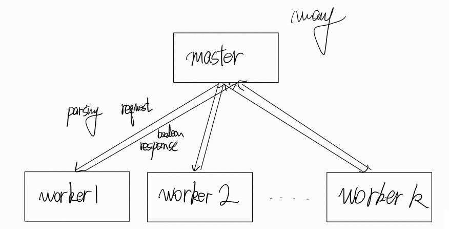
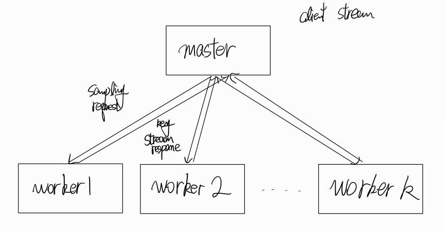
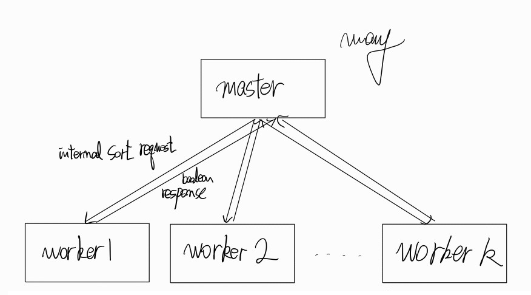
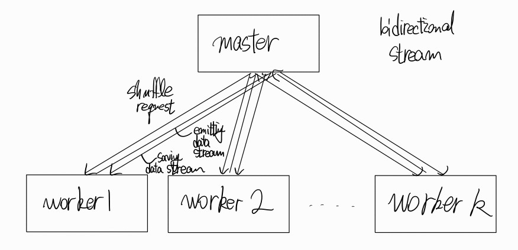
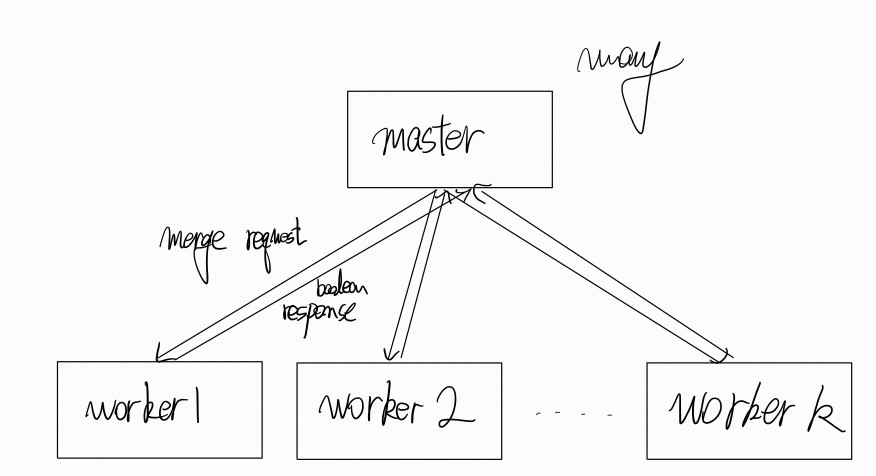

# 332project
Upload CSED332(Software Design Method) group project works

## Index
[1. Participants](#participants)
[2. Milestone](#milestone)
[3. Weekly Progress](#weekly-progress)
[4. Workflow](#workflow)
[5. Feedback](#feedback)

## Participants

[@문동균](https://github.com/moondg)
[@배재륜](https://github.com/bjr7000)
[@이윤혁](https://github.com/a-nodi)

## Milestone
Refering on the _The Mythical Man-Month_, the development period was divided into 3 parts
- 1. `Design phase` (~ Week 3)
- 2. `Programming & Minor debuging phase` (~ Week 6)
- 3. `System test, obtaining all components` (~ Week 8)

### Milestone #1
- Establish connection between master and worker
- Design distributed sorting algorithm for this project
- Generate sample input data for testing key-value parsing

### Milestone #2
- Complete key-value parsing
- Send and receive sample datas between master and worker

### Milestone #3
- Implement sampling
- Implement partitioning

### Milestone #4
- Implement parsing
- Implement shuffling

### Milestone #5
- Implement sorting
- Implement mergeing

### Milestone #6
- Test integrated milestone #3 with sample data to see it works well
- Debug errors for sample data

### Milestone #7
- Test distributed sorting program with intensive data
- Debug all remaining errors for intensive data

## Weekly Progress

### Week 1

#### Progress in the week
- Convention disccusioned
- Seeking useful librarys for implementing this project
- Reading gRPC Docs

### Week2

#### Progress in the week
- Configured project setting with *Metals, sbt, ScalaCheck*
- Pseudo code based on merge sort
- Design K-way merge using tournament tree between compute nodes
- Apply Week1 feedback
- Design network interaction

### Week3

#### Progress in the week
- Pseudo code for K-way merge
- Rough design for network and its exception
- Divide pseudocode design into master & worker
- Design abstact structure of sorting (Sampling)
- Construct detailed network interation messages
- Study how to use multiple cores with scala

#### Goal of the next week
[@문동균](https://github.com/moondg)
- Pseudo code for IO
- Design abstact structure of sorting (Shuffle)
- Design overall functions and test cases(mergesort)

[@배재륜](https://github.com/bjr7000)
- Pseudo code for key-value parsing
- Design overall functions and test cases(sampling)


### Week4
- Removed network worker-worker interaction
- Plan for handling packet loss
- Planned disconnection recovery
- Use concorrent programming to prevent master bottleneck

#### Goal of the next week
[@이윤혁](https://github.com/a-nodi)
- Design protobuf
- Design overall functions and test cases(network)

## Workflow
Workflow based on TDD (Test Driven Development)

### Commit & Pull request convention
- `Feature`: Add new function
- `Fix`: Fix bug
- `Docs`: Modify Document
- `Chore`: Change Settings (build, project configs...)
- `Test`: Add/Fix Test suite
- `Refactor`: Refactor code

### Branch convention
- `main`: For release
- `develop`: Merge test-passed features
- `test-[TestName]`: Develop feature and testsuite

## Feedback
### Week 1 (Applied)
- Heavy Milestone #3: Milestones should have similar workloads. Milestone should take feedbacks from previous Milestone.
- No need to follow Mythical Man Month strictly: Update development cycle by merging programming phase and testing/debuging phase.
- Parsing/Sort/Partition/Shuffle, Merge/Sampling is closely related: Well-defined interface needed, extra effort for communication needed.
- TDD's idea is "test is a some kind of document": Record TDD application for docs with details.

### Week 2
- Check pseudocode: Partitioning and Shuffling
- Introducing proper locking mechanism
- Network defect: reconnect between nodes and recovering network

### Week 3
- Tournament tree: initialization, save, data type, metadata
- Network interaction: role of Master, necessity of Worker-Worker
- Flexibly divide components: interaction may contain multiple messages For example, network disconnection can be problem for this.

## Design
### Pseudocode
Master
```C++
divide_data(number_of_worker);
for i in 0 to number_of_worker, i++:
  internal_sort(disk[i])
  queue.insert({i})
merged = number_of_worker
while(merged != 1):
  concurrent_excute(send, receive)

send:
  while(queue.size > 1):
    one = queue.front
    queue.pop
    two = queue.front
    queue.pop
    if(one.size < two.size):
      swap(one, two)
    network_send(to: worker[one].head, next_worker: worker[one], work_with: worker[two], reply: {worker[two], worker[one]}.flatten, next_head: True)
    network_send(to: worker[two].head, next_worker: worker[two], work_with: worker[one], reply: empty, next_head: False)
    merged -= 2

recevie:
  recevied_msg = network_receive()
  if(recevied_msg == sort_done):
    queue.push(sort_done_recieve)
    merged += 1
  if(recevied_msg == wrong_send):
    resend_msg(to: proper_worker)
```

Worker:
```C++
next_worker, work_with, reply, next_head = network_receive()
if(next_worker.head != self):
  network_exception_reply(exception: wrong_send)
else:
  interrupt_on(network_receive, recevie)
  if(next_head):
    while(True):
      sort()
      if(is_there_done && is_here_done):
        break;
    if(to.tail == empty):
      network_send(to: master, sort_done: reply)
    else:
      network_send(to: next_worker.tail.head, next_worker: next_worker.tail, work_with: work_with, reply: reply, next_head: next_head)

sort:
  if(RAM.my_disk.empty && !is_here_done):
    my_disk = disk_cursor ~ disk_cursor + BLOCK_SIZE
    disk_cursor += BLOCK_SIZE
    if(disk_cursor > DISK_SIZE):
      is_here_done = True
    RAM_push(my_disk)
  if(RAM.received_msg.empty && !is_there_done):
    network_send(to: work_with.head, msg: RAM.sorted_data)
    wait_until_receive()
    RAM.sorted_data.flush
  else if(RAM.received_msg.empty && is_there_done):
    disk_push(RAM.sorted_data)
    disk_push(RAM.my_disk)
    is_here_done = True
    RAM.flush
  while(!RAM.my_disk.empty || !RAM.received_msg.empty):
    take_smaller_one_and_pop()
    RAM_push(sorted_data, smaller_one)

receive:
  if(received_msg == sort_done_here):
    next_worker = next_worker.tail
    if(next_worker == NULL):
      is_there_done = True
    else:
      resend_msg(to: next_worker.tail.head)
  else if(sort_done):
    network_exception_reply(exception: sort_done_here)
  else if(next_head):
    RAM_push(received_msg)
  else:
    RAM_push(received_msg)
    network_send(to: work_with.head, memory(disk_cursor ~ disk_cursor + BLOCK_SIZE))
    disk_push(RAM.received_msg)
    disk_cursor += BLOCK_SIZE
```


### Network Interaction 

Plan for handling packet loss
```
TCP-like acknowlegement message: All Messages have their own TCP-like acknowlegement message to ensure the message sendings were performed well.  
Timeout: If acknowlegement message doesn't arrive during speific time(e.g. timeout), resend the message.
```

Plan for handling disconnection
```
Use TCP-like exponential backoff to not spem reconnection tries.
To recover from disconnection, create checkpoint tokens and manipulate with queue for each master-worker connection.
Checkpoints should be orderly enqueued, dequeue checkpoints that has been passed
Should not init checkpoint queue at start of the program; shuffling-like phase needs multiple checkpoints to ensure atomic  
Need testcases that causes disconnection intentionally.
```

Plan for network interaction enhancement
```
Remove worker-worker direction communication.
All data communications are now fully controlled by master
To prevent bottleneck of master caused by multiple network connection, handle network connection concurrently.
Use semaphore with max value 1 to implement locking mechanism.
```

|Message type|Content|Sender|Receiver|
|:---:|:---:|:---:|:---:|
|SyncronizationRequest|IP and port of worker|worker|master|
|SyncronizationResponse|Boolean that indicates worker ip and ports are valid|master|worker
|ParseRequest|No content|master|worker|
|ParseResponse|Boolean that indicates parsing has been complete successfully|worker|master|
|SamplingRequest|Number of wanted samples|master|worker|
|SamplingResponse|Stream of sample keys|worker|master|
|PartitioningRequest|No content|master|worker|
|PartitioningResponse|Boolean that indicates partitioning has been complete successfully|worker|master
|InternalSortRequest|No content|master|worker|
|InternalSortResponse|Boolean that indicates internal sorting of worker has been complete successfully|worker|master|
|ShuffleRequest|Stream of data that should be exchanged, sending ip and port|worker|master|
|ShuffleResponse|Stream of data that should be exchanged, sending ip and port|master|worker|
|MergeRequest|No content|master|worker|
|MergeResponse|Boolean that indicates merging has been complete successfully|worker|master|

#### parsing


#### sampling


#### internal sorting


#### shuffling(Deprecated, Update needed)
worker - worker connection should be more simple


#### merging

